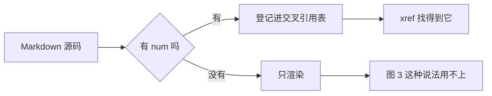
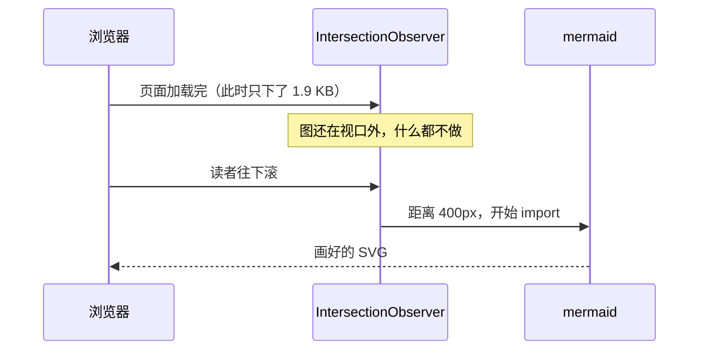
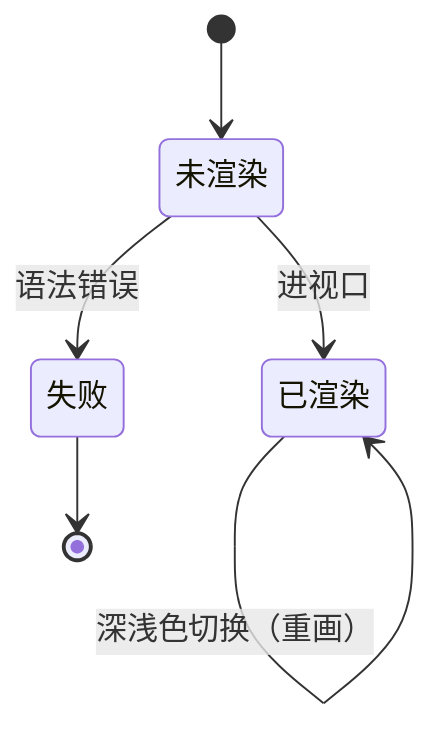

三种图表围栏，取舍不同：

- **`goat`** 构建时就渲染成 SVG，零运行时、零依赖（Hugo 内建 `diagrams.Goat`）。
  画得了线、框、箭头。没有 JS、没有网络、打印时都一样在。
- **`mermaid`** 浏览器端渲染，图种齐全（流程、时序、类、状态、ER、甘特、饼、
  思维导图…）。代价是要加载库 —— 但**只在图滚进视口时才加载**，页面本身只多
  1.4 KB。
- **`plantuml`** 构建时算出 URL，浏览器取一张图片，零 JS。UML 的图种最全，
  但要一台服务器 —— **默认关着**，配了 `params.ui.plantuml.server` 才渲染。

## goat

```goat
    .----------.
   | Markdown   |
    '----+-----'
         |
         v
    .----+-----.
   | Hugo build |
    '----+-----'
         |
         v
    .----+-----.
   | static SVG |
    '----------'
```

它认字符网格：`-` `|` `+` 画线，`.` `'` 画圆角，`v` `^` `<` `>` 画箭头。
源码在编辑器里就是图的样子，改一条线不用重新想语法。

### goat 的标签只能用 ASCII

**别在 goat 里写中日韩文字。** 它的坐标是字符网格，一格 8px；而一个汉字渲染出来
占 13.33px，比格子宽 5.33px —— 每个字都会压住右边那个，一行下来糊成一片。这不是
可以调字号绕开的事：把字号调小到不重叠，ASCII 那部分就细得看不清了。

要中文标签就用 `mermaid`，它自己算文字宽度。

## mermaid



时序图：



## 带编号

给了 `num` 就登记进交叉引用表，和 `` 走同一条路 —— 一张流程图
和一张图片在「图 3」这个说法里没有区别：



引用它：见 。

`goat` 也能带编号：

```goat {num="2" caption="两条路的分岔"}
 .---------.   build    .-----.
| goat      +--------->| SVG   |
 '---------'            '-----'

 .---------.  browser   .-----.
| mermaid   +--------->| SVG   |
 '---------'            '-----'
```

图里的标签是 ASCII，`caption` 是中文 —— caption 走的是普通 HTML 文本，不受
字符网格限制。

## plantuml

UML 图。构建时算出 URL，浏览器只发一个 `` —— 零 JS，打印和无 JS 时都在。

```plantuml {caption="时序图" num="3"}
Alice -> Bob: 请求
Bob --> Alice: 响应
Bob -> Bob: 自己记一笔
```

`@startuml`/`@enduml` 可以省，写不写都行。

**默认关着。** 没配 `params.ui.plantuml.server` 时这个围栏只渲染源码 —— 主题
不给它默认值，因为默认指向公共服务器等于让每个装了主题的站点把作者的图发给
第三方，而图里可能是内部系统的架构。配置：

```toml
[params.ui.plantuml]
server = "https://www.plantuml.com/plantuml"   # 或自托管地址
format = "svg"                                  # svg | png
```

它和其他运行时不同的地方：PlantUML 的渲染器是 Java，没有能塞进浏览器的实现，
图只能由一台服务器画。所以这是主题里唯一"渲染要靠网络"的围栏 —— 但联网的是
读者的浏览器取图片，构建时什么都不下载。

## 没画出来会怎样

mermaid 的源码**留在页面上**，渲染成功后才隐藏它。JS 没跑、chunk 没下下来、
图写错了这三种情况下，读者看到的是那段图描述 —— `A --> B` 本来就是给人读的。
渲染成空白的话，读者不知道自己错过了什么。

写错的图另外加一条警示边：

```mermaid
graph TD
    A --> 这里少了右括号[
```

`plantuml` 同理留着源码，但没有"渲染失败"这个状态：图是普通 ``，取不到时
浏览器显示 `alt`，与站点里其他图一致。探测失败只能靠 `onerror`，而内联事件
处理器是注入面，主题一律不输出。

## 图表列表


