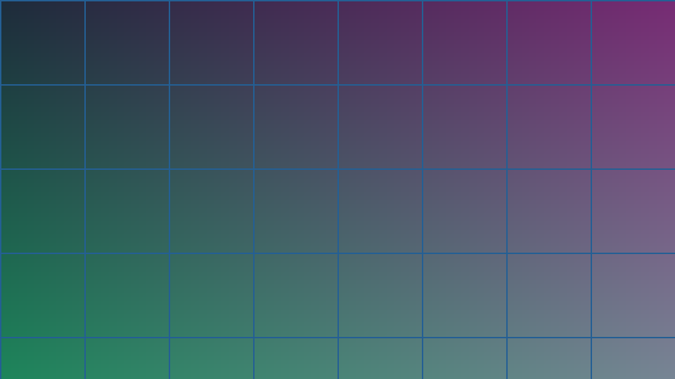

块级图独占一段。固有尺寸从资源读出来写进 `width`/`height` —— 没有这两个属性
的图在载入前占 0 高，载入后把下面的内容顶下去，那是最刺眼的一类布局抖动，而
修它只需要构建时读一次资源。

上面这张图的 `width="960" height="540"` 不是写在 Markdown 里的，是构建时从
PNG 头部读的。

## caption

有 `caption` 才升级成 `<figure>`。没有说明文字的 figure 只是个语义空壳。

{caption="图注居中，颜色比正文淡一档 —— 它在解释图，不在陈述内容。"}

## 显式尺寸

`width`/`height` 覆盖固有尺寸。非正整数会 warn 并退回固有值，不中断构建。

{width="480" height="270"}

## 链接

`link` 需要 `caption`。裸的链接图 Markdown 自己就写得出：
``，不需要一个属性。

{caption="点开跳到 Hugo 官网" link="https://gohugo.io/"}

## 装饰图

空 `alt` 是 WAI-ARIA 里"这张图是装饰"的正式写法，不是忘了写。输出 `alt=""`，
屏幕阅读器会跳过它。

## 行内图

一行文字中间的图  只出 ``，不套 `<figure>`
也不加块级外边距 —— 它是这句话的一部分，加外边距会把行高撑开。
