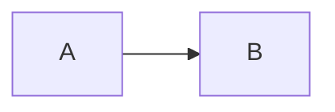

# Fence languages

Generated from the codeblock render hooks by `scripts/gen-skill-fences.js`. Do not edit by hand — `node scripts/gen-skill-fences.js --check` fails if this file drifts from them.

These are **not shortcodes.** Each is a fenced code block whose language name the theme handles. This is one of the few mistakes here that fails loudly: `` stops the build with `template for shortcode "mermaid" not found`.

Attributes go in braces after the language name:

````markdown

````

**Block attributes require `[markup.goldmark.parser.attribute] block = true` in the site config.** Without it the brace line renders as body text. See `config.md`.

**Every fence also accepts `class`, `data-*`, and `aria-*`** on top of the attributes listed per language below. An unlisted attribute is dropped with a warning and the block still renders — verified: an unknown attribute warns `(allowed: caption, num, id, class, data-*, aria-*)` and the diagram appears anyway.

## Contents

- [checksums](#checksums) — Turn `sha*sum` output into a table of download links and checksums.
- [chem](#chem) — Chemical equation.
- [echarts](#echarts) — Chart rendered in the browser by Apache ECharts.
- [filetree](#filetree) — Directory tree with per-type icons.
- [gallery](#gallery) — Grid of images.
- [goat](#goat) — ASCII diagram converted to SVG. No runtime, no network.
- [math](#math) — Display equation.
- [mermaid](#mermaid) — Diagram rendered in the browser by Mermaid.
- [plantuml](#plantuml) — UML diagram rendered server-side into a plain ``.
- [Ordinary code fences](#ordinary-code-fences)

## checksums

Turn `sha*sum` output into a table of download links and checksums.

**Body:** One `<hash>  <filename>` pair per line, exactly as `sha256sum` prints it.

**Attributes:** `base`, `algo`, `group`

**Attribute constraints** — an attribute name alone does not mean any value works:

- `algo`: algo must be md5, sha1, sha256, or sha512 — skipping the block
- `group`: group must be auto — ignoring it
- `base`: base is only valid without release_url front matter — skipping the block
- `base`: base must not be empty — skipping the block
- `base`: base must use http or https — skipping the block
- `base`: base URL requires a host — skipping the block
- `base`: base URL must not contain a query or fragment — skipping the block
- `base`: base is required unless the page has release_url front matter — skipping the block

## chem

Chemical equation.

**Body:** mhchem notation, e.g. `CO2 + C -> 2 CO`. The `\ce{}` wrapper is added for you.

**Attributes:** `title`

**Attribute constraints** — an attribute name alone does not mean any value works:

- `title`: title must not be empty — dropping it

## echarts

Chart rendered in the browser by Apache ECharts.

**Body:** A JSON ECharts option object.

**Attributes:** `caption`, `num`, `id`, `height`

**Attribute constraints** — an attribute name alone does not mean any value works:

- `height`: height must be an integer between 10 and 9999 — using a value in that range
- `id`: id requires num — ignoring it

## filetree

Directory tree with per-type icons.

**Body:** One path per line using box-drawing characters (`├──`, `│`, `└──`). A `#` starts a trailing comment on that line.

**Attributes:** `title`

**Attribute constraints** — an attribute name alone does not mean any value works:

- `title`: title must not be empty — dropping it

## gallery

Grid of images.

**Body:** One Markdown image per line. A trailing `# caption` labels that image. Attributes go on each line, not on the fence.

**Attributes:** none accepted on the fence itself.

## goat

ASCII diagram converted to SVG. No runtime, no network.

**Body:** ASCII art using `-`, `|`, `+`, `.`, `'`, and arrowheads.

**Attributes:** `caption`, `num`, `id`

**Attribute constraints** — an attribute name alone does not mean any value works:

- `id`: id requires num — ignoring it

## math

Display equation.

**Body:** LaTeX. Backslashes are safe here — inside `$$…$$` a `\\` is eaten once by the Markdown parser, so the author has to write four; the fence has no such problem.

**Attributes:** `title`

**Attribute constraints** — an attribute name alone does not mean any value works:

- `title`: title must not be empty — dropping it

## mermaid

Diagram rendered in the browser by Mermaid.

**Body:** Mermaid source, e.g. `graph LR` followed by edges.

**Attributes:** `caption`, `num`, `id`

**Attribute constraints** — an attribute name alone does not mean any value works:

- `id`: id requires num — ignoring it

## plantuml

UML diagram rendered server-side into a plain ``.

**Body:** PlantUML source, e.g. `Alice -> Bob: request`. No `@startuml` wrapper needed.

**Attributes:** `caption`, `num`, `id`, `alt`

**Attribute constraints** — an attribute name alone does not mean any value works:

- `id`: id requires num — ignoring it

**Requires `params.ui.plantuml.server` in the site config.** Without it the fence renders its source as a plain code block instead of a diagram. The theme ships no default server on purpose: pointing at a public one would send every site's diagrams — possibly internal architecture — to a third party.

## Ordinary code fences

Any other language goes through the base hook, which accepts these attributes:

`id`, `filename`, `copy`, `collapse`, `wrap`

````markdown
```go {filename="main.go" collapse="true"}
func main() {}
```
````

Syntax highlighting needs `[markup.highlight] noClasses = false` in the site config, or code blocks keep light-mode colours in dark mode. See `config.md`.
